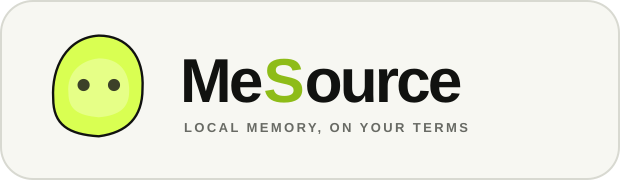
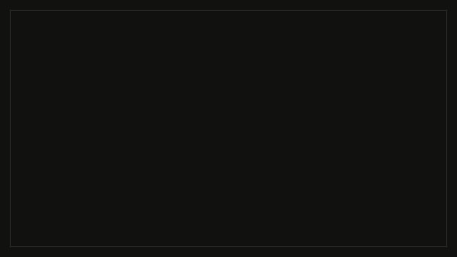

<p align="center">
  
</p>

<p align="center">
  
  
  
  
  
</p>

<p align="center">
  A local-first personal memory layer that gives AI only the context it is allowed to recall.
</p>

## What is MeSource?

MeSource turns supported local activity sources into a provenance-aware ontology. Raw imports are
stored in a canonical SQLite graph, while each AI session receives a separate capability database
containing only the rows permitted by its world policy. The model can explore that reduced database
through bounded, read-only SQL over a local stdio MCP server.

The desktop-first web interface provides a focused view for reviewing projects, attributes, sources,
and memory state. It runs with in-memory demo data by default and can be connected to a REST API with
`VITE_API_BASE_URL`.

## Technical overview

| Layer | Technology | Purpose |
| --- | --- | --- |
| Interface | React, TypeScript, Vite | Fast, typed project and memory curation UI |
| Local engine | Python 3.11+ standard library | Deterministic import, policy materialization, lifecycle, and query controls |
| Storage | SQLite | Canonical ontology graph plus physically reduced per-session capability databases |
| AI boundary | stdio MCP, read-only SQL | Policy-bounded access with row, time, and audit limits |
| Quality | `unittest`, ESLint, TypeScript | Backend policy/security tests and frontend static checks |

The current importers support a documented subset of Chromium History, Codex Markdown logs, and
Google Maps Saved Places exports. No third-party Python package, network service, API key, or cloud
database is required for the local ontology engine.

## Quickstart

### 1. Run the interface

Requirements: Node.js with npm.

```sh
git clone https://github.com/codex-hakathon-1/personal-rag-ontology.git
cd personal-rag-ontology/frontend
npm ci
npm run dev
```

Open the local URL printed by Vite. The interface starts immediately with demo data; no backend setup
is needed. To use a REST server instead, create `frontend/.env.local`:

```dotenv
VITE_API_BASE_URL=http://localhost:8000
```

### 2. Verify the local ontology boundary

Requirements: Python 3.11 or newer. Run these commands from the repository root:

```sh
python3 plugins/local-ontology/scripts/review_fixture.py --session-dir .local-ontology-review
python3 -m unittest discover -s plugins/local-ontology/tests -v
```

The fixture builds a canonical graph, applies a world policy, materializes a capability database,
and proves that forbidden rows remain present in the canonical store but absent from model-facing
SQL results.

### 3. Install the Codex plugin (optional)

```sh
codex plugin marketplace add .
codex plugin add local-ontology@personal
```

Restart the Codex app or begin a new Codex CLI session after installation so the skill and MCP server
are discovered.

## Repository layout

```text
.
├── frontend/                 React + TypeScript interface
├── plugins/local-ontology/  Python engine, MCP server, schemas, fixtures, and tests
├── docs/assets/              README brand assets
└── .agents/plugins/         Local Codex plugin marketplace metadata
```

For the complete importer contracts, privacy model, policy behavior, and adversarial proof, see the
[Local Ontology documentation](./local-ontology-plugin-spec.md).

## Development checks

```sh
cd frontend
npm run lint
npm run build
```

```sh
python3 -m unittest discover -s plugins/local-ontology/tests -v
```

## Product demo

See MeSource in motion—from local source discovery to project memory curation—in a short product
film.

<p align="center">
  <a href="./frontend/public/media/mesource-demo.mp4">
    
  </a>
</p>

<p align="center">
  <a href="./frontend/public/media/mesource-demo.mp4">Watch the HD demo with sound (MP4)</a>
</p>

## Presentation

The team presentation is available at [MESOURCE_1팀.pdf](./MESOURCE_1팀.pdf).
