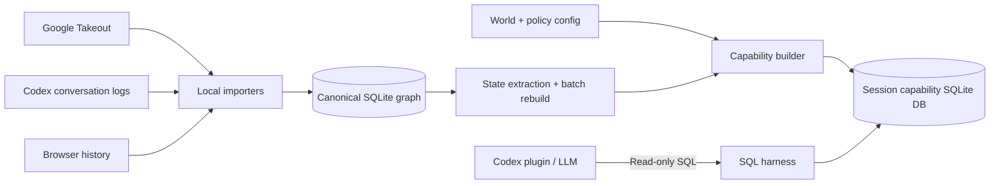

# Local Ontology for Codex

> A local, policy-bounded memory graph that an LLM queries with SQL only when it decides context is needed.

## 1. Product thesis

Most personal-memory systems optimize for recall: capture everything, retrieve the most similar text, and inject it into the prompt. That creates the failure mode this project targets: irrelevant, stale, role-inappropriate, or superseded memories enter a session merely because they are semantically similar.

This plugin optimizes for **exclusion before recall**. It turns personal activity records into a local SQLite graph, then lets the LLM execute ordinary read-only SQL against a session-specific database containing only the facts that policy permits.

The LLM begins with **no personal context**. It receives only:

1. how to query the database;
2. the available schema and column meanings;
3. the current world identifier and policy contract; and
4. a small `GLOBAL MEMORY` containing non-personal, invariant operating rules.

When the conversation suggests that personal context may help, the LLM identifies an entity in the user's words and writes SQL. No entity match means no personal data is retrieved or injected.

## 2. Scope and non-goals

### In scope (MVP)

- A Codex plugin packaged with `.codex-plugin/plugin.json`.
- Local-only importers for three sources:
  - Google Takeout;
  - Codex conversation logs;
  - Chromium-family browser history.
- A SQLite relational graph represented with `nodes` and `edges`, queried with SQL and recursive CTEs.
- Explicit world separation and deterministic policy filtering.
- A query harness that permits read-only SQL while preventing access to the original store or prohibited SQLite capabilities.
- A clear README that explains and demonstrates the safety boundary without requiring a live demo.

### Deliberately out of scope

- Continuous screen/audio capture. Screenpipe is a design reference and a future optional importer, not an MVP dependency.
- Vector embeddings, vector search, and similarity ranking as the primary retrieval mechanism.
- Cloud sync, account creation, multi-user sharing, GUI, automatic world switching, and autonomous actions.
- Perfect entity extraction, full Takeout coverage, or complete browser support.
- A general-purpose graph database or Cypher/SPARQL interface.

## 3. Design principles

| Principle | Consequence |
| --- | --- |
| Search is not the goal; absence is. | Demonstrate what cannot enter context, not only what can be found. |
| SQL is the LLM-facing language. | The model can use joins, predicates, aggregation, and recursive CTEs. No generated Cypher/SPARQL. |
| Policy must be non-bypassable. | The model never connects to the canonical database. |
| Worlds are explicit. | Entity resolution never crosses a world boundary by inference. |
| State is materialized before reading. | `active`, `dormant`, and `superseded` are written by import/batch jobs; reads only filter. |
| Local-first includes the control plane. | Imports, graph construction, policies, and capability databases stay on-device. |
| Provenance is mandatory. | Every returned fact points to source records and dates. |

## 4. User-facing behavior

### Startup

The plugin contributes static instructions and a query tool. It does **not** preload facts, summaries, entities, recency lists, or an “ambient brief.”

```text
GLOBAL MEMORY
- This is a read-only, policy-bounded personal-memory database.
- Query only when the user’s request would benefit from personal historical context.
- Use `nodes`, `edges`, and `evidence`; recursive CTEs are available for graph traversal.
- Treat SQL results as dated evidence, cite their provenance, and state uncertainty.
- Do not attempt writes, PRAGMAs, ATTACH, extensions, or access beyond this database.
- The selected world is <world_id>; results from other worlds do not exist in this session.
```

`GLOBAL MEMORY` contains only this operational contract. It contains no personal facts, preferences, relationships, or prior decisions.

### On demand

For a request such as “작년에 일본 여행 계획 어떻게 됐지?”, the LLM may:

1. identify `Japan` and `travel plan` as possible anchors;
2. query the available graph using SQL;
3. recursively expand only relevant edges; and
4. answer from returned, policy-approved evidence with dates and source labels.

For a request without a personal anchor, it does nothing special. The plugin must make “no query” a normal and correct outcome.

## 5. Architecture



### Canonical graph

The canonical SQLite database is private to import and maintenance commands. It has complete local data and is never exposed to the LLM query connection.

### Capability database

At session creation, the policy engine builds a fresh in-memory SQLite database containing only nodes, edges, and evidence eligible for the selected world. The LLM can freely compose `SELECT` statements over this database, but cannot query omitted records by a clever join, CTE, or predicate because they are physically absent.

This is the key enforcement choice. It preserves the LLM experience of direct SQL while making policy independent of prompt obedience or fragile SQL-string rewriting.

### SQL harness

The harness opens the capability database in read-only/query-only mode, validates a single read-only statement, sets SQLite resource limits, and rejects:

- `INSERT`, `UPDATE`, `DELETE`, `REPLACE`, `CREATE`, `ALTER`, `DROP`, `VACUUM`;
- `ATTACH`, `DETACH`, `PRAGMA`, `load_extension`, and transaction control;
- multiple statements and access to temp/system tables;
- result sets or execution times beyond configured limits.

The harness returns rows as structured data with truncation metadata. It records an audit entry containing SQL fingerprint, execution time, row count, and session/world identifiers; it does not need to retain the full result payload.

## 6. Data model

SQLite is the graph database. The graph is relational rather than a separate graph engine because the LLM is expected to produce reliable SQL and recursive CTEs.

### Core tables

```sql
CREATE TABLE worlds (
  world_id       TEXT PRIMARY KEY,
  name           TEXT NOT NULL,
  description    TEXT NOT NULL,
  enabled        INTEGER NOT NULL DEFAULT 1
);

CREATE TABLE nodes (
  node_id        TEXT PRIMARY KEY,
  world_id       TEXT NOT NULL REFERENCES worlds(world_id),
  type           TEXT NOT NULL,
  canonical_name TEXT NOT NULL,
  summary        TEXT,
  state          TEXT NOT NULL CHECK (state IN ('active', 'dormant', 'superseded')),
  sensitivity    TEXT NOT NULL DEFAULT 'normal',
  valid_from     TEXT,
  valid_to       TEXT,
  last_seen_at   TEXT,
  superseded_by  TEXT REFERENCES nodes(node_id),
  created_at     TEXT NOT NULL,
  updated_at     TEXT NOT NULL
);

CREATE TABLE node_aliases (
  alias           TEXT NOT NULL,
  node_id         TEXT NOT NULL REFERENCES nodes(node_id),
  source          TEXT NOT NULL,
  confidence      REAL NOT NULL,
  PRIMARY KEY (alias, node_id)
);

CREATE TABLE edges (
  edge_id         TEXT PRIMARY KEY,
  world_id        TEXT NOT NULL REFERENCES worlds(world_id),
  from_node_id    TEXT NOT NULL REFERENCES nodes(node_id),
  relation        TEXT NOT NULL,
  to_node_id      TEXT NOT NULL REFERENCES nodes(node_id),
  state           TEXT NOT NULL CHECK (state IN ('active', 'dormant', 'superseded')),
  valid_from      TEXT,
  valid_to        TEXT,
  confidence      REAL NOT NULL,
  evidence_count  INTEGER NOT NULL DEFAULT 0,
  created_at      TEXT NOT NULL,
  updated_at      TEXT NOT NULL
);

CREATE TABLE evidence (
  evidence_id     TEXT PRIMARY KEY,
  node_id         TEXT REFERENCES nodes(node_id),
  edge_id         TEXT REFERENCES edges(edge_id),
  source_kind     TEXT NOT NULL,
  source_ref      TEXT NOT NULL,
  occurred_at     TEXT,
  observed_at     TEXT NOT NULL,
  excerpt         TEXT,
  content_hash    TEXT NOT NULL
);
```

Required indexes: `nodes(world_id, type, state)`, `nodes(world_id, canonical_name)`, `node_aliases(alias)`, `edges(world_id, from_node_id, state)`, `edges(world_id, to_node_id, state)`, and `evidence(node_id, occurred_at)`.

### Node types for the MVP

Use a small, stable vocabulary instead of a generic ontology framework:

- `person`, `place`, `organization`, `event`, `trip`, `item`, `document`, `topic`, `preference`, `plan`, `decision`, `conversation`, `web_page`.

Time does **not** require a separate ontology branch. Any node or edge can have `valid_from`, `valid_to`, and `state`. This avoids early type-system complexity while correctly representing both durable people/places and expiring plans/preferences.

### Edge relations for the MVP

`mentioned_in`, `about`, `planned_for`, `visited`, `related_to`, `prefers`, `owns`, `decided`, `supersedes`, `contradicts`, `occurred_at`, `source_of`.

Relations are strings constrained by importer validation, not an unrestricted user-authored taxonomy.

## 7. Importers and normalization

All importers emit a common intermediate record:

```text
source_kind, source_ref, occurred_at, raw_text_or_metadata, candidate_entities, provenance
```

The normalizer deduplicates with stable source references and content hashes, creates or updates nodes/edges, and stores evidence. Initial extraction may be deterministic heuristics plus a local/remote LLM extraction adapter, but source data and extracted claims are always retained separately.

### 7.1 Google Takeout

MVP support one valuable, well-bounded export rather than pretending to support Takeout generally:

- Google Maps Timeline or Saved Places, if present;
- optionally Google Photos metadata as a second Takeout adapter.

The README must state the exact archive paths supported and show a fixture. Unsupported Takeout products are skipped with a report, never silently misparsed.

### 7.2 Codex conversation logs

Import Markdown logs as conversations, messages, decisions, plans, and supersession signals. Treat direct, explicit statements such as “this replaces X” as high-confidence `supersedes` evidence; ordinary recency is not sufficient to claim supersession.

Do not import secrets. Apply a conservative redaction pass before persistence for token/key-like values and known secret paths.

### 7.3 Browser history

Copy the browser History SQLite file to a temporary read-only location before querying it, because Chromium normally holds it locked. Import URL, title, visit time, host, and visit count. Content bodies are not captured in the MVP.

Normalize a visited page into `web_page` and `topic` candidates. The original URL stays as provenance; sensitive URL patterns are excluded before graph construction.

## 8. World and policy model

Worlds are explicit, user-authored compartments, configured in a local policy file. Suggested initial worlds:

```yaml
worlds:
  personal:
    include_sources: [google_takeout, browser_history, codex_logs]
    deny_sensitivity: [secret, identity]
    include_states: [active]
  travel:
    include_sources: [google_takeout, browser_history, codex_logs]
    allow_node_types: [trip, place, event, plan, item, web_page, topic]
    include_states: [active, dormant]
```

For the MVP, the selected world is explicit plugin configuration. The LLM cannot infer, switch, widen, merge, or enumerate worlds. Entity resolution searches aliases only in the selected capability database.

### State lifecycle

| State | Meaning | How it is assigned |
| --- | --- | --- |
| `active` | currently relevant or not known to have expired | importer default or explicit update |
| `dormant` | historic but potentially useful | inactivity/age rule during batch rebuild |
| `superseded` | replaced by a newer explicit fact or decision | explicit replacement evidence or curator action |

State is calculated on writes and periodic batch rebuilds. Read-time policy only applies fixed predicates; it does not reclassify data using LLM judgment.

## 9. Retrieval pattern

The plugin documentation gives the LLM a canonical query pattern, not a retrieval API:

```sql
WITH RECURSIVE neighborhood(node_id, depth, path) AS (
  SELECT n.node_id, 0, n.node_id
  FROM nodes n
  LEFT JOIN node_aliases a ON a.node_id = n.node_id
  WHERE n.state = 'active'
    AND (n.canonical_name LIKE '%' || :anchor || '%'
         OR a.alias LIKE '%' || :anchor || '%')

  UNION ALL

  SELECT e.to_node_id, nb.depth + 1, nb.path || '>' || e.to_node_id
  FROM neighborhood nb
  JOIN edges e ON e.from_node_id = nb.node_id
  WHERE e.state = 'active'
    AND nb.depth < 2
    AND instr(nb.path, e.to_node_id) = 0
)
SELECT n.type, n.canonical_name, n.summary, n.last_seen_at,
       e.source_kind, e.source_ref, e.occurred_at
FROM neighborhood nb
JOIN nodes n ON n.node_id = nb.node_id
LEFT JOIN evidence e ON e.node_id = n.node_id
ORDER BY nb.depth, e.occurred_at DESC
LIMIT 30;
```

This is intentionally an example, not a mandated query. The LLM can use all ordinary read-only SQL within the capability database.

## 10. Plugin package

```text
local-ontology/
├── .codex-plugin/
│   └── plugin.json
├── skills/
│   └── local-ontology/SKILL.md
├── scripts/
│   ├── import_takeout.py
│   ├── import_codex_logs.py
│   ├── import_browser_history.py
│   ├── rebuild_state.py
│   └── query_harness.py
├── schema/
│   ├── canonical.sql
│   └── capability.sql
├── examples/
│   ├── policy.example.yaml
│   └── demo-fixture/
├── tests/
└── README.md
```

`plugin.json` should declare the plugin name, version, skill entry point, and query-tool integration according to the current Codex plugin specification. Keep the runtime dependency surface to Python standard library plus an explicitly documented SQLite driver if needed.

## 11. Security and privacy claims

The README may claim only what this implementation enforces:

- Data is processed and stored locally by default.
- The model cannot query the canonical database through the supplied tool.
- Cross-world and policy-denied rows are absent from the session capability database.
- SQL is read-only and restricted by the harness.
- Every answerable claim has source/date provenance.

It must not claim that raw source files are encrypted, that all sensitive data is detected, or that an arbitrary model cannot exfiltrate data it has legitimately queried.

## 12. Success criteria

The submission succeeds if its README lets a reviewer verify these five assertions without a video:

1. **No preload:** a fresh session receives no personal facts.
2. **Direct SQL:** the model uses normal SQL, including a recursive CTE, to retrieve context on demand.
3. **Non-bypassable exclusion:** a `superseded` record and a record in another world are not queryable—even with intentionally adversarial SQL.
4. **Provenance:** retrieved claims name source and date.
5. **Local, concrete import:** fixtures exercise all three importers and build a reproducible SQLite graph.

Required automated tests:

- read-only harness rejects every prohibited statement class;
- `ATTACH`/`PRAGMA`/multi-statement attempts fail;
- cross-world and excluded-state rows are absent from the capability DB;
- a recursive CTE returns an allowed two-hop subgraph;
- each importer produces normalized records from fixture data;
- batch rebuild transitions a stale plan to `dormant` and explicit replacement to `superseded`.

## 13. README narrative and proof layout

The README is the product demo. Its order should be:

1. One-sentence thesis: “Personal memory that an LLM must earn with SQL—and cannot over-recall.”
2. The failure mode: vector recall leaks stale and wrong-world context.
3. The architecture diagram and explicit capability-DB boundary.
4. A 30-line “happy path” SQL example.
5. A 10-line “adversarial query” that returns no forbidden row because it is absent.
6. The three working importers, supported input paths, and fixture command.
7. Privacy model, limitations, and roadmap including optional Screenpipe adapter.

Avoid a feature checklist. The reviewer should leave with a single falsifiable claim: **policy changes the database the model can query, not merely the instructions it is given.**

## 14. 3–7 day implementation plan

| Day | Deliverable |
| --- | --- |
| 1 | Plugin scaffold, canonical schema, fixtures, policy file, capability builder |
| 2 | Read-only SQL harness and bypass tests |
| 3 | Browser-history and Codex-log importers |
| 4 | One narrow Google Takeout importer and state rebuild |
| 5 | End-to-end fixture, recursive-CTE example, README first complete draft |
| 6–7 | Hardening, screenshots/terminal transcripts in README, packaging, cleanup |

If time is constrained to three days, support only Google Maps Takeout, Chromium history, and Markdown Codex logs; prioritize policy-boundary tests and README proof over extraction sophistication.

## 15. Explicit deferred decisions

- Entity extraction model and confidence thresholds.
- Exact dormancy thresholds by node/edge type.
- More detailed sensitivity classes and secret redaction patterns.
- Per-query result/token limits and cost accounting.
- Screenpipe importer adapter and any continuous-capture source.
- User-facing world-selection UX.

These do not block the MVP because the enforcement boundary, three import sources, SQL interface, and state lifecycle are already fixed.
